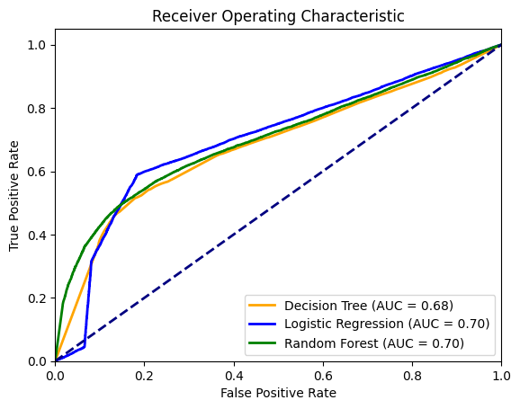

<link rel="stylesheet" href="styles.css" type="text/css">
<link rel="stylesheet" href="site_libs/academicons-1.9.1/css/academicons.min.css"/>

   

## **Predicting shipment time range and evaluating delay risk**

 

   

### 1-1. Figure

[Fig. LASSO regression features by importance]

 
  

### 1-2. Figure

[Fig. ROC Curves by Each Model]

 

  

### 2. Goal
Forecasting the duration of shipments and assessing the likelihood of delayed deliveries.

+ Developing Machine learning models to ascertain the potential shipping time range by forecasting both the quickest and typical delivery durations for shipments, encompassing both domestic and international customers.

+ Constructing a Binary Classifier to identify orders with a significant likelihood of experiencing delays (Late Delivery Risk Analyzer).

 

### 3. Methodology & Summary

<b>Methodology</b>
  
  + Conducted exploratory data analysis to understand various shipment data and processed the data to build Various machine learning models such as XGBoost, Support Vector Machines (SVM), and Neural Networks to estimate shipment time ranges, enhancing accuracy in forecasting delivery schedules.
  + Performed feature selection by using Lasso cross-validation to choose important features and employed Decision Tree, Logistic Regression, and Random Forest models for a binary classification problem aimed at evaluating the likelihood of delivery delays. 
  + The evaluation of the model's effectiveness was carried out using several metrics, such as Root Mean Square Error (RMSE), accuracy, precision, recall, and the Area Under the Receiver Operating Characteristic Curve (AUC).
  
<b>Evaluation and Summary</b>
  
  + Predicting shipment time range: The XGBoost model also performs very well with a cross validation RMSE of 0.1162.
  
  + Evaluating the likelihood of delivery delays : Considering Accuracy, Precision, Recall and AUC scores, the Logistic Regression model (Accuracy: 69.13%, Precision: 79.64%, Recall: 58.93% , ACU scores: 0.70) offers the best balance between all metrics, with the highest accuracy and precision and a competitive AUC score. Thus, the Logistic Regression model is the best overall model among the three.

 

### 4. Code

Please click [HERE](https://nbviewer.org/github/hyunbitrishapark/hyunbitrishapark.github.io/blob/main/files/Predicting_shipment_time_range_and_evaluating_delay_risk.ipynb) for the analysis report and code.

 

